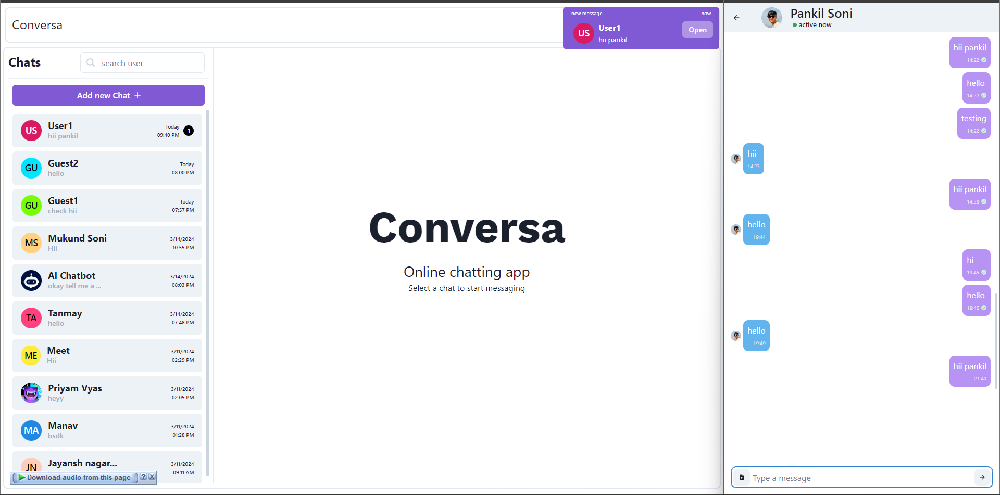

# DivineTalk Chat Application

A real-time chat application built with the MERN stack (MongoDB, Express, React, Node.js).


## Features

- Real-time messaging with socket.io integration
- User authentication with JWT
- Friend management system
- Online status indicators
- Profile customization
- Dark/Light theme
- Message delivery and read receipts
- File and image sharing
- Typing indicators
- Mobile responsive design

## Tech Stack

- **Frontend**: React.js with Chakra UI
- **Backend**: Express.js, Node.js
- **Database**: MongoDB
- **Real-time Communication**: Socket.io
- **Authentication**: JWT (JSON Web Tokens)
- **File Storage**: AWS S3/Cloudinary

## Screenshots

### Authentication Screen


### Chat Interface


## Setup Instructions

### Prerequisites
- Node.js (v14.0.0 or later)
- MongoDB (local or Atlas)
- npm or yarn

### Installation

1. Clone the repository
```
git clone https://github.com/shhbhm/DivineTalk.git
cd DivineTalk
```

2. Install dependencies for backend
```
cd backend
npm install
```

3. Install dependencies for frontend
```
cd ../frontend
npm install
```

4. Create .env file in the backend directory with the following variables:
```
PORT=5000
MONGO_URI=your_mongodb_connection_string
JWT_SECRET=your_jwt_secret
```

5. Start the backend server
```
cd ../backend
npm start
```

6. Start the frontend server
```
cd ../frontend
npm start
```

## Project Structure
- `/backend` - Express server, API routes, controllers, and models
- `/frontend` - React application with components and services
  - `/src/components` - React components
  - `/src/context` - React context for state management
  - `/src/assets` - Static assets like images and sounds

## Future Enhancements
- Group chat functionality
- End-to-end encryption
- Voice and video calling
- Message reactions
- Message search

## Contributing
Contributions are welcome! Please feel free to submit a Pull Request.

## License
This project is licensed under the MIT License - see the [LICENSE](LICENSE) file for details.

## Author
Developed by Shubham Solanki
